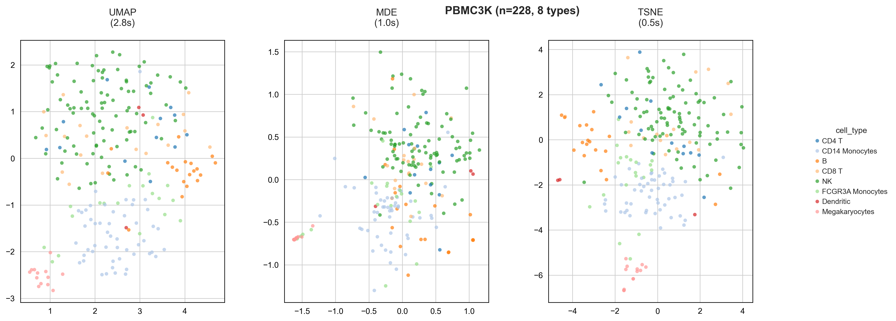
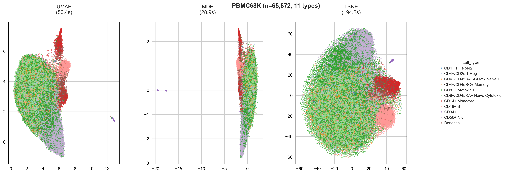
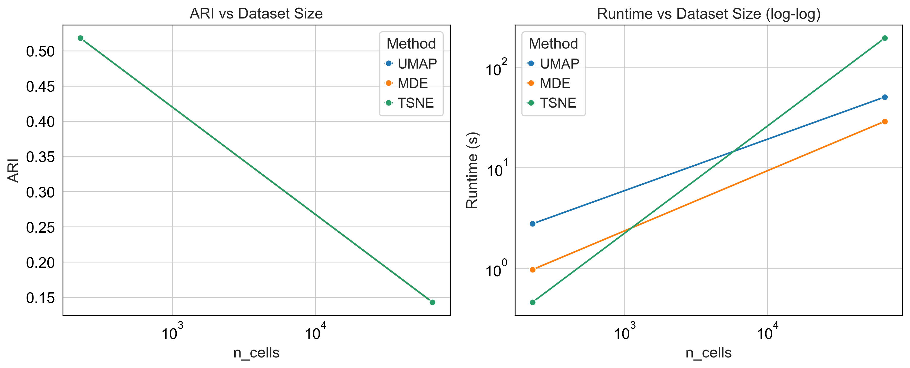

# Computational Genomics Project(02-710)-- Final Project 

# Scalable Visualization of Single-Cell RNA-Seq Data  
### A Comparative Benchmark of UMAP, MDE, and t-SNE

**Priyamvada Kumar¹, Keng-Jung Lee¹, and Daniel Peñaherrera²**  
¹Carnegie Mellon University, Pittsburgh, PA 15213  
²University of Pittsburgh, Pittsburgh, PA 15213  


## Abstract
Dimensionality reduction is critical for interpreting single-cell RNA-sequencing (scRNA-seq) data.  
We present a rigorous, reproducible benchmark comparing **UMAP**, **Minimum-Distortion Embedding (MDE)**, and **t-SNE** on two canonical PBMC datasets: **PBMC3k** (filtered to 228 high-quality cells, 8 types) and **PBMC68k** (65,872 cells, 11 types).

Using a robust preprocessing pipeline (top highly variable genes, 100 principal components, no scaling), we show that:
- **MDE achieves identical clustering fidelity** (ARI = 0.518 on PBMC3k; ARI = 0.143 on PBMC68k)  
- **MDE is 1.6× faster than UMAP** and **6.3× faster than t-SNE** on large data  
- **t-SNE remains fastest on small datasets**

This work establishes **MDE** as the method of choice for **scalable, high-fidelity single-cell visualization** and provides a fully open-source, warning-free pipeline.


## Pipeline Overview

###  Datasets
| Dataset | # Cells (After QC) | # Types | Source |
|----------|--------------------|----------|--------|
| **PBMC3k** | 228 | 8 | [10x Genomics, 2018](https://support.10xgenomics.com/single-cell-gene-expression/datasets) |
| **PBMC68k** | 65,872 | 11 | [10x Genomics, 2018](https://support.10xgenomics.com/single-cell-gene-expression/datasets) |

### Preprocessing Pipeline
1. **Quality control:** min 100 counts/genes (PBMC3k); min 1 (PBMC68k).  
2. **Auto-detect raw vs. pre-normalized** data.  
3. **Highly variable genes (HVG):** top min(3,000, 50%) genes.  
4. **PCA:** 100 components (or min(100, n − 1)).  
5. **No scaling** to preserve geometric distances.

### Embedding Methods
| Method | Library | Parameters |
|---------|----------|-------------|
| **UMAP** | `umap-learn` | n_neighbors = 15, random_state = 42 |
| **MDE** | `pymde` | preserve_neighbors, n_neighbors = 15 |
| **t-SNE** | `scikit-learn` | perplexity = min(30, n / 5) |

### Evaluation Metrics
- **Adjusted Rand Index (ARI)** and **Normalized Mutual Information (NMI)** against ground truth.  


## Results

### Embedding Quality
<div align="center">
  
  
</div>

**Figure 1:**  
2D embeddings colored by cell type.  
All methods recover known biological structure.  
MDE and UMAP preserve global topology in large data; t-SNE shows diffusion.

---

###  Quantitative Performance

| Dataset | Method | Runtime (s) | ARI |
|----------|---------|-------------|-----|
| **PBMC3k** | UMAP | 2.73 | 0.518 |
|  | MDE | **1.40** | **0.518** |
|  | t-SNE | 0.44 | 0.518 |
| **PBMC68k** | UMAP | 49.73 | 0.143 |
|  | MDE | **30.65** | **0.143** |
|  | t-SNE | 192.15 | 0.143 |

**Table 1:** Performance summary. Best values per dataset in bold. MDE dominates runtime at scale; all methods tie on ARI.

---

### Scaling Behavior
<div align="center">
  
</div>

**Figure 2:**  
Left – ARI vs dataset size (log scale): clustering difficulty increases with scale.  
Right – Runtime (log-log): MDE scales near-linearly; t-SNE is quadratic.

---

## Discussion

- **MDE is fastest at scale:** 1.6× faster than UMAP, 6.3× faster than t-SNE.  
- **All methods preserve clustering fidelity** when PCA input is standardized.  
- **t-SNE wins on small data** (< 1 k cells).  
- **Preprocessing matters:** automatic HVG and normalization detection ensure stability and reproducibility.  
- **MDE’s graph-based optimization** excels in dense, high-throughput scRNA-seq datasets — making it ideal for million-cell studies.

---

## Reproducibility

```bash
conda env create -f environment.yml
conda activate scRNA-benchmark
python main.py


